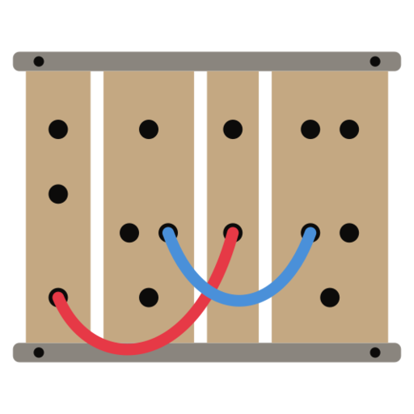

<div align="center">

<picture>
  <source media="(prefers-color-scheme: dark)" srcset=".github/brand/mark-light.svg">
  <source media="(prefers-color-scheme: light)" srcset=".github/brand/mark-dark.svg">
  
</picture>

# panproto

**Migrate data between any two schema versions, automatically.**

[](https://github.com/panproto/panproto/actions/workflows/ci.yml)
[](https://crates.io/crates/panproto-core)
[](https://www.npmjs.com/package/@panproto/core)
[](https://pypi.org/project/panproto/)
[](https://docs.rs/panproto-core)
[](LICENSE)

</div>

panproto reads your schema (an ATProto Lexicon, OpenAPI spec, Avro schema, or [47 others](crates/panproto-protocols) with built-in protocol theories), figures out what changed, and generates the code to convert your data from the old shape to the new one. Formats without a dedicated protocol theory, including JSON Schema, Protobuf, GraphQL, and SQL DDL, are read on the same pipeline through tree-sitter source parsing rather than as protocol theories. It can also parse source code in 259 programming languages (via tree-sitter) and treat the full AST as a schema, so the same diff/migrate/version-control workflow works on code structure, not just data formats. It version-controls your schemas the same way git version-controls your source code.

## What problem does this solve?

Every time you change an API response, rename a database column, or update a config file format, you need migration code. Writing that code by hand is tedious and error-prone. panproto automates it:

1. **Diff** two schema versions to see exactly what changed (fields added, removed, renamed, types widened).
2. **Classify** the change as fully compatible, backward compatible, or breaking, using the rules of the specific schema language.
3. **Generate** a bidirectional lens that can convert records from the old schema to the new one (and back, without losing data).
4. **Version-control** your schemas with git-style commands (`commit`, `branch`, `merge`, `diff`) so your schema history is as clean as your code history.
5. **Parse source code** in 261 languages (TypeScript, Python, Rust, Go, Java, C, and [255 more](crates/panproto-grammars)) into the same schema representation, so you can diff, migrate, and version-control code structure alongside data schemas.

It works the same way regardless of whether your schema is an OpenAPI spec, an ATProto lexicon, an Avro schema, or a FHIR resource. panproto treats all of them as instances of a common structure.

## Installation

### CLI (`schema`)

```sh
# macOS (Homebrew)
brew install panproto/tap/panproto-cli

# Linux / macOS (shell installer)
curl --proto '=https' -LsSf https://github.com/panproto/panproto/releases/latest/download/panproto-cli-installer.sh | sh

# Windows (PowerShell)
powershell -ExecutionPolicy ByPass -c "irm https://github.com/panproto/panproto/releases/latest/download/panproto-cli-installer.ps1 | iex"

# From source (any platform with Rust)
cargo install panproto-cli
```

The `schema` binary's `--protocol` flag currently accepts `atproto` only; other formats are read on the tree-sitter source-parse path (`schema parse`) rather than through a protocol theory.

### SDKs

| Package | Install |
|---------|---------|
| [`@panproto/core`](bindings/typescript) | `npm install @panproto/core` |
| [`panproto`](bindings/python) | `pip install panproto` |
| [`panproto`](bindings/haskell) (Haskell binding) | clone the repo, then `cd bindings/haskell && ./bootstrap/fetch-bindist.sh && cabal build` (Hackage publish pending) |

The Python wheel ships with the eleven `group-core` tree-sitter grammars (Python, JavaScript, TypeScript, Java, C#, C++, PHP, Bash, C, Go, Rust). The remaining ~240 grammars are split across separately-installable companion packs: `pip install panproto-grammars-functional` adds Haskell, OCaml, Elm, Gleam, Erlang, Elixir, PureScript, F#, Clojure, Scheme, Racket; the same pattern applies to `web`, `systems`, `jvm`, `scripting`, `data`, `devops`, `mobile`, `music`, and an `all` umbrella. Each pack registers its grammars with `panproto.AstParserRegistry()` automatically. See [bindings/python/README.md#companion-grammar-packs](bindings/python/README.md#companion-grammar-packs) for the full table.

## Quick start

### TypeScript

```typescript
import { Panproto } from '@panproto/core';

const p = await Panproto.init();
const proto = p.protocol('atproto');

// Build a schema
const schema = proto.schema()
  .vertex('post', 'record', { nsid: 'app.bsky.feed.post' })
  .vertex('post:body', 'object')
  .vertex('post:body.text', 'string')
  .edge('post', 'post:body', 'record-schema')
  .edge('post:body', 'post:body.text', 'prop', { name: 'text' })
  .constraint('post:body.text', 'maxLength', '3000')
  .build();

// Convert a record between schema versions in one line
const converted = p.convert(record, oldSchema, newSchema);

// Or build a reusable converter for batch processing
const chain = p.protolensChain(oldSchema, newSchema);
const result = chain.apply(record);
```

### Python

```python
import panproto

proto = panproto.get_builtin_protocol("atproto")

builder = proto.schema()
builder.vertex("post", "record", "app.bsky.feed.post")
builder.vertex("post:body", "object")
builder.vertex("post:body.text", "string")
builder.edge("post", "post:body", "record-schema")
builder.edge("post:body", "post:body.text", "prop", "text")
builder.constraint("post:body.text", "maxLength", "3000")
schema = builder.build()

# Diff two schema versions
diff = panproto.diff_schemas(old_schema, new_schema)
report = diff.classify(proto)
print(report.compatible)       # True/False
print(report.report_text())    # human-readable summary

# Auto-generate a converter between two schema versions.
# The third element, `coerce_proposals`, is empty unless the call passes
# `stringency="exploratory"`.
lens, quality, coerce_proposals = panproto.auto_generate_lens(old_schema, new_schema, proto)
view, complement = lens.get(instance)
```

### Rust

```rust
use panproto_core::*;

let proto = panproto_protocols::atproto::protocol();
let schema = schema::SchemaBuilder::new(&proto)
    .vertex("post", "record", Some("app.bsky.feed.post"))?
    .vertex("post:body", "object", None)?
    .vertex("post:body.text", "string", None)?
    .edge("post", "post:body", "record-schema", None)?
    .edge("post:body", "post:body.text", "prop", Some("text"))?
    .constraint("post:body.text", "maxLength", "3000")
    .build()?;

// Auto-generate a lens between two schema versions
let lens = panproto_lens::auto_generate(&src_schema, &tgt_schema)?;
let (view, complement) = panproto_lens::get(&lens, &instance)?;
```

### CLI

```sh
# Version control
schema init                              # initialize repo, auto-detect packages
schema add schema.json                   # stage a JSON schema
schema add crates/panproto-gat/          # stage a directory (parsed via tree-sitter)
schema commit -m "initial schema"
schema status                            # per-file changes grouped by package
schema log
schema branch feature
schema checkout feature
schema merge main
schema diff --staged                     # diff staged vs HEAD
schema diff --theory old.json new.json   # sort/op-level diff

# Schema tools
schema validate --protocol atproto schema.json
schema check --src old.json --tgt new.json --mapping mig.json
schema scaffold --protocol atproto schema.json
schema normalize --protocol atproto schema.json

# Lens operations
schema lens generate old.json new.json
schema lens apply lens.json record.json
schema lens verify lens.json --instance test.json
schema lens compose lens1.json lens2.json
schema lens inspect chain.json

# Data operations
schema data convert --src-schema old.json --tgt-schema new.json record.json
schema data migrate records/

# Full-AST parsing (261 languages)
schema parse file src/main.ts
schema parse project ./src
schema parse emit src/main.ts

# Git bridge
schema git import /path/to/repo HEAD
schema git export --repo . /path/to/dest

# Expression REPL
schema expr eval "2 + 3 * 4"
schema expr parse "\\x -> x + 1"
schema expr repl
```

## Workspace

| Crate | What it does |
|-------|--------------|
| [`panproto-gat`](crates/panproto-gat) | The math engine that everything else is built on. Defines sorts (types), operations, equations, and structure-preserving maps between theories. |
| [`panproto-expr`](crates/panproto-expr) | A small functional language used for data transforms during migration: lambdas, pattern matching, 60 built-in functions. |
| [`panproto-expr-parser`](crates/panproto-expr-parser) | Parser for the expression language (Haskell-style syntax with operator precedence). |
| [`panproto-schema`](crates/panproto-schema) | Represents schemas as graphs: vertices are types, edges are fields/relationships, constraints are validation rules. |
| [`panproto-inst`](crates/panproto-inst) | Represents actual data (instances). Handles converting data between schema versions by walking the instance tree and remapping fields. |
| [`panproto-mig`](crates/panproto-mig) | The migration engine. Checks whether a migration between two schemas is valid, compiles it, and applies it to data. |
| [`panproto-lens`](crates/panproto-lens) | Bidirectional converters (lenses) that can transform data forward and backward between schema versions without losing information. |
| [`panproto-lens-dsl`](crates/panproto-lens-dsl) | Write lens specifications declaratively in Nickel, JSON, or YAML instead of code. |
| [`panproto-theory-dsl`](crates/panproto-theory-dsl) | Write theory (schema language) definitions declaratively in Nickel, JSON, or YAML. |
| [`panproto-check`](crates/panproto-check) | Detects breaking changes between two schema versions: added/removed fields, type changes, constraint violations. |
| [`panproto-protocols`](crates/panproto-protocols) | 50 built-in schema language definitions (protocol theories): ATProto, OpenAPI, AsyncAPI, Avro, FHIR, GeoJSON, and more. |
| [`panproto-io`](crates/panproto-io) | Reads and writes instance data in each protocol's native format (JSON, XML, YAML, CSV, etc.) with optional format-preserving round-trips. |
| [`panproto-vcs`](crates/panproto-vcs) | Git-style version control for schemas: commit, branch, merge, diff, log, blame, bisect. |
| [`panproto-parse`](crates/panproto-parse) | Parses source code in 259 programming languages into schema graphs using tree-sitter grammars. |
| [`panproto-grammars`](crates/panproto-grammars) | Pre-compiled tree-sitter grammars for 261 languages (build-time dependency, not published). |
| [`panproto-project`](crates/panproto-project) | Assembles multi-file projects into a single schema, resolving cross-file imports. |
| [`panproto-git`](crates/panproto-git) | Translates between git repositories and panproto's version control, so `git push` works with panproto repos. |
| [`panproto-core`](crates/panproto-core) | Convenience re-export of all the above crates. Add one dependency instead of many. |
| [`panproto-wasm`](crates/panproto-wasm) | WebAssembly build of the engine, used by the TypeScript SDK. |
| [`panproto-py`](crates/panproto-py) | Native Python bindings via PyO3. |
| [`panproto-grammars-{group}`](crates/panproto-grammars-functional) | Companion grammar packs (`functional`, `web`, `systems`, `jvm`, `scripting`, `data`, `devops`, `mobile`, `music`, `all`). One pyo3 cdylib per group; ship as separate pip-installable wheels that contribute grammars to `panproto.AstParserRegistry()` via the `panproto.grammars` entry point. |
| [`panproto-c`](crates/panproto-c) | Panic-safe C ABI for non-Rust language bindings. Generated by `safer-ffi`. |
| [`panproto-xrpc`](crates/panproto-xrpc) | XRPC client for pushing/pulling schemas to panproto node servers. |
| [`panproto-cli`](crates/panproto-cli) | The `schema` command-line tool. Hosts the interactive REPL for theories, terms, and morphisms (`schema theory repl`). |
| [`panproto-git-remote`](crates/panproto-git-remote) | Git remote helper (`git-remote-panproto` binary) that makes `git push panproto://` work. |

## How it works

panproto has a layered architecture. Each layer builds on the one below:

**Layer 0: The algebra engine** (`panproto-gat`). This is the foundation. It implements a system for defining "theories": sets of types, operations on those types, and equations those operations must satisfy. Think of it as a type system for type systems. A theory defines what a valid schema looks like for a particular format.

**Layer 1: Protocol definitions** (`panproto-protocols`). Each schema language (OpenAPI, ATProto, Avro, etc.) is described as a theory. For example, the OpenAPI theory says "a schema has vertices of kind `object`, `string`, `array`, etc., connected by edges of kind `prop`, `items`, `ref`, etc." Adding a new schema language means writing a new theory definition. No engine code changes.

**Layer 2: Schemas** (`panproto-schema`). A concrete schema (like your `api.yaml` or `schema.json`) is an instance of a theory. panproto represents it as a labeled directed graph where vertices are types and edges are relationships.

**Layer 3: Instances** (`panproto-inst`). Actual data records are instances of a schema. panproto can walk an instance tree, remap it to match a new schema, and serialize it back to JSON/XML/YAML/etc.

**Layer 4: Lenses** (`panproto-lens`). A lens is a pair of functions: one that converts data forward (old schema to new) and one that converts it backward (new to old). panproto can generate these automatically from two schema versions, and the backward conversion preserves information through a "complement" (the data that the forward conversion dropped). Protolenses generalize this: a single protolens definition works on any schema matching a pattern, not just two fixed schemas.

**Version control** (`panproto-vcs`). Schemas are version-controlled like source code. When you merge two branches, panproto computes the merge structurally (not by text diffing), which avoids the merge conflicts you'd get with a naive text-based approach.

## Building

```sh
# Rust
cargo build --workspace
cargo nextest run --workspace

# WASM
wasm-pack build crates/panproto-wasm --target web

# TypeScript SDK
cd bindings/typescript && pnpm install && pnpm build

# Python SDK (native PyO3 bindings)
maturin develop --manifest-path crates/panproto-py/Cargo.toml
```

## Documentation

- [The panproto book](https://panproto.dev/book/): the complete reference, from the mathematical foundations (categories, GATs, colimits, lenses) through the Rust implementation, the expression language, the protocol catalogue, schematic version control, the SDKs, and a contributor guide.
- [API Reference (docs.rs)](https://docs.rs/panproto-core)

## Acknowledgments

panproto was architected and implemented with substantial assistance from Claude Code.

## License

[MIT](LICENSE)
