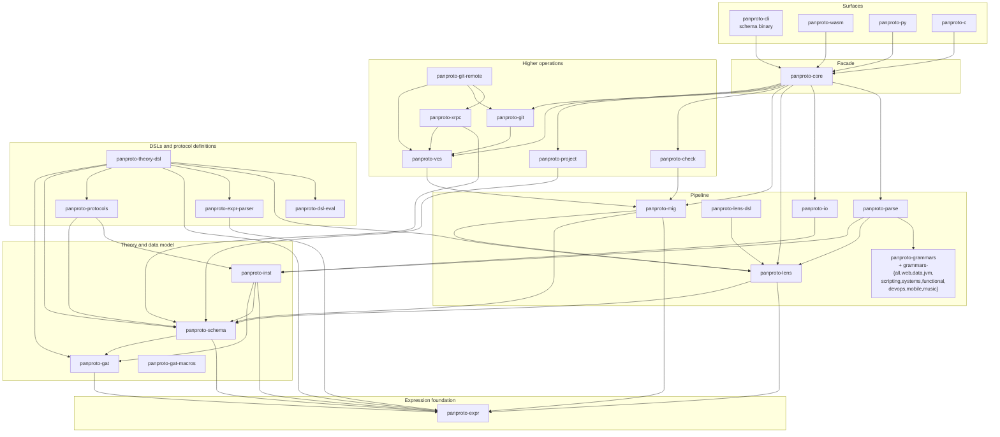

# Architecture

panproto is a Rust workspace with an acyclic Cargo dependency graph. We place the expression crate below the GAT engine because conflict policies and directed equations can contain expressions. Schema and instance code depends on both; most user-facing surfaces reach the higher operations through `panproto-core`.

Read this chapter after [Schemas as theories](./schemas-as-theories.md) and [Migrations as morphisms](./migrations-as-morphisms.md). Use the graph as a boundary map and the [crate map](../reference/crate-map.md) for the crate-by-crate inventory.

## Layering

An arrow points from a crate to one of its dependencies. The diagram omits many direct edges and feature-gated dependencies; each crate's `Cargo.toml` is authoritative. The ten `panproto-grammars-*` pack crates are grouped together: each re-exports a subset of tree-sitter grammars under feature flags.

One arrow worth pointing out: `panproto-parse` depends on `panproto-lens`, not the other way around. The two crates meet through the `enrichment_registry` module in `panproto-lens`, a thin trait-and-registry pair the lens crate exposes for downstream crates to populate. `panproto-parse` installs an adapter for every parser it accepts so that protolens machinery in `panproto-lens` can dispatch grammar-driven enrichment synthesis without depending on tree-sitter. The mechanism is documented in [Layout enrichment](./layout-enrichment.md); the registry pattern keeps the lens crate grammar-agnostic and the dependency direction acyclic.

## The boundaries

Three places in the system are *boundary layers* in the sense that they convert between panproto's internal representation and an external one. They are deliberately thin and concentrated in single crates so they can be audited independently.

### WASM boundary

JavaScript reaches `panproto-core` through the `wasm-bindgen` boundary in `panproto-wasm`. Structured data crosses that boundary as MessagePack, while a slab of opaque integer handles keeps Rust resources alive. The TypeScript SDK ([`@panproto/core`](https://www.npmjs.com/package/@panproto/core)) adds initialization, handle management, types, and higher-level operations.

### Python boundary

Python uses the native PyO3 bindings in `panproto-py` rather than WASM. Its default Rust feature is `group-core`, and the published wheel is built with default features, so it ships the eleven core tree-sitter grammars; the other 250 of the 261 the feature manifest declares live in the companion `panproto-grammars-*` packs.

### C boundary

`panproto-c` is the only crate that knows about C ABI. It exposes a stable C interface used by the Haskell and Swift bindings (and any other non-Rust language). CBOR is the over-the-boundary format here.

## The generated CLI reference

The `schema` binary's `--help` text is the source of truth for the CLI surface. The [reference/cli](../reference/cli.md) page is regenerated by an `xtask` (see [`xtask/src/bin/gen-cli-docs.rs`](https://github.com/panproto/panproto/blob/main/xtask/src/bin/gen-cli-docs.rs)) and CI fails if the page is out of date. This is the only generated file in the docs site.

## Versioning

All workspace crates read their version from `workspace.package.version` and are released in lockstep. The language SDKs follow the workspace release version. See the [changelog](https://github.com/panproto/panproto/blob/main/CHANGELOG.md) for release history.

## See also

- [Crate map](../reference/crate-map.md) for one-line descriptions of every crate.
- [What panproto verifies](./what-is-verified.md) for the per-crate properties checked.
- [Composing protocols by colimit](./protocol-colimits.md) for the GAT-engine consumer pattern.
