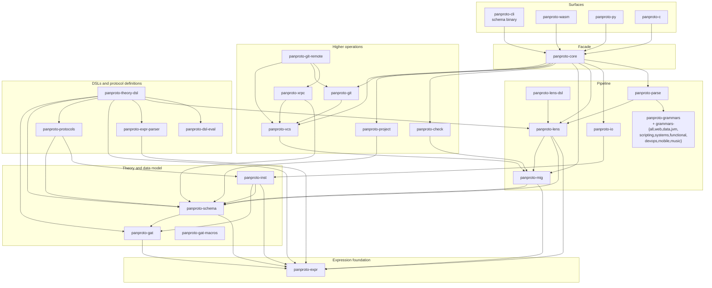

# Architecture

panproto is a Rust workspace with an acyclic Cargo dependency graph. `panproto-expr` sits below the GAT layer because directed equations and several policy types may contain expressions. The schema and instance crates depend on these foundations, while `panproto-core` provides a facade over the operations used by most language bindings and the CLI.

Read this chapter after [Schemas as theories](./schemas-as-theories.md) and [Migrations as morphisms](./migrations-as-morphisms.md). Use the graph as a boundary map and the [crate map](../reference/crate-map.md) for the crate-by-crate inventory.

## Layering

An arrow points from a crate to one of its dependencies. The diagram omits many direct edges and feature-gated dependencies; each crate's `Cargo.toml` is authoritative. The ten `panproto-grammars-*` pack crates are grouped together: each re-exports a subset of tree-sitter grammars under feature flags.

`panproto-parse` depends on `panproto-lens`; the lens crate does not depend on the parser crate. They meet through the `enrichment_registry` module in `panproto-lens`, which defines traits and a registry that downstream parser implementations populate. `panproto-parse` installs adapters so that protolens interpretation can request grammar-driven enrichment without introducing a tree-sitter dependency into `panproto-lens`. [Layout enrichment](./layout-enrichment.md) describes this boundary.

## The boundaries

The language bindings translate between panproto's Rust representation and external runtimes. Each boundary uses a different ownership and serialization strategy.

### WASM boundary

JavaScript reaches `panproto-core` through `wasm-bindgen` in `panproto-wasm`. Structured data crosses the boundary as MessagePack, while a slab of opaque integer handles retains Rust-owned resources. The TypeScript SDK ([`@panproto/core`](https://www.npmjs.com/package/@panproto/core)) manages initialization and handles and provides typed wrappers.

### Python boundary

Python uses native PyO3 bindings in `panproto-py`. Its default Rust feature is `group-core`, and the wheel workflow builds with that default, which includes eleven core tree-sitter grammars. Companion `panproto-grammars-*` packs expose category-specific selections and a `group-all` selection containing all 261 declared grammars.

### C boundary

`panproto-c` defines the C ABI with `safer-ffi` and serializes structured payloads with CBOR. The Haskell and Swift bindings call this interface.

## The generated CLI reference

The CLI reference is generated from `schema --help` by [`xtask/src/bin/gen-cli-docs.rs`](https://github.com/panproto/panproto/blob/main/xtask/src/bin/gen-cli-docs.rs). Publication regenerates the page and fails when the committed file differs.

## Versioning

The publishable `panproto-*` crates inherit the workspace package version and are released together. The `xtask` tooling package is an exception with its own `0.0.0` version. Release checks keep language-binding metadata aligned with the workspace release. See the [changelog](https://github.com/panproto/panproto/blob/main/CHANGELOG.md) for release history.

## See also

- [Crate map](../reference/crate-map.md) for one-line descriptions of every crate.
- [What panproto verifies](./what-is-verified.md) for the per-crate properties checked.
- [Composing protocols by colimit](./protocol-colimits.md) for the GAT-engine consumer pattern.
