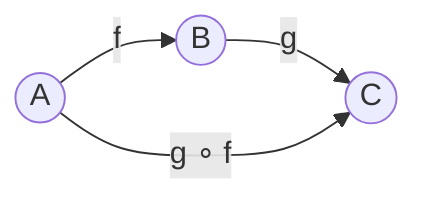

# Categories

This chapter introduces *categories*, the mathematical structure that organizes the rest of the book. The notion is due to @eilenbergmaclane1945general, with the abelian-category generalisation developed shortly after in @grothendieck1957sur; the references at the end of the chapter develop it further. The idea is not specific to the problems panproto addresses: it appears in programming language theory, logic, topology, databases, and many other settings. Our concern here is what it means for a schema, the data under it, and the migrations between schema versions to be three instances of this one structure.

The chapter begins with composition, the operation that sits at the centre of the definition, worked through in three settings: function composition in a programming language, command composition in a Unix shell, and migration composition in panproto. A formal definition follows that pins down the four pieces of data a category consists of and the two laws those pieces satisfy. We then verify that function composition and panproto's schemas yield genuine categories, with a candid note on why the Unix example does not. Every protocol in this book is a category or a construction on one, every migration is a morphism in a category of schemas, and every merge in panproto's version control is a colimit in a category of patches.

The book uses [Haskell](https://www.haskell.org/) as its primary notation for mathematical definitions and worked examples. Haskell's type syntax is close to the standard mathematical notation for morphisms, and panproto's own expression language has a Haskell-flavoured surface syntax, so fluency in the Haskell of the foundations chapters transfers directly to the migrations and protolens specifications the later chapters ask the reader to write. [Rust](https://www.rust-lang.org/), the language panproto is implemented in, appears whenever the book needs to show what the implementation actually looks like. Neither language is a prerequisite; new syntax is glossed on first sight.

## Composition

A category in the mathematical sense is a structure whose primitive operation is *composition*: given two arrows whose ends fit, we obtain a third arrow from the start of the first to the end of the second. Before giving the formal definition, we walk through three settings in which the primitive operation is already familiar. Two of the settings are from ordinary programming. The third is the subject of the book.

### Function composition

Consider two functions: one that maps a raw string to a trimmed string, and a second that maps a trimmed string to a date. Their composite maps a raw string to a date; we obtain it by applying the second function to the output of the first. Haskell writes the two functions as

```haskell
trim  :: String -> String
parse :: String -> Date
```

*Listing 1.1: Two function types, in Haskell notation. The double colon reads "has the type", and an arrow between two types denotes a function type from its left argument to its right.*

and their composition with a period:

```haskell
parse . trim :: String -> Date
```

*Listing 1.2: Function composition in Haskell. The period reads as "after": `parse . trim` is parse after trim, and applied to a string `s` it returns `parse (trim s)`.*

The composite function has the same shape as its two components: it takes one argument of some input type and returns one result of some output type. The order of composition runs right to left, which matches function application and the standard mathematical convention for morphism composition. Unix pipes and the F# `>>` chevron compose left to right; the book adopts the right-to-left convention throughout, to match the notation we will use for morphisms in general.

Rust, which is the language panproto is implemented in, writes the same composite differently:

```rust
fn trim(s: String) -> String { /* ... */ }
fn parse(s: String) -> Date  { /* ... */ }

fn parse_trimmed(s: String) -> Date {
    parse(trim(s))
}
```

*Listing 1.3: The same composition in Rust. Rust has no single operator analogous to Haskell's period, so the composite is constructed by writing a new function whose body applies the two originals in sequence.*

Rust and Haskell disagree on notation and on what the language gives us for free. They agree on what composition is. The composite in Listing 1.3 is the same mathematical object as the composite in Listing 1.2, whether or not the language provides an operator for it.

### Command composition in a Unix shell

A [Unix](https://en.wikipedia.org/wiki/Unix) pipeline exhibits the same primitive operation on different material.

```
lsof | grep Chrome | wc -l
```

*Listing 1.4: A Unix pipeline composed from three commands.*

Each command is a process that reads from standard input and writes to standard output. The vertical bar chains processes left to right; the pipeline has the standard input of the leftmost command and the standard output of the rightmost. The bar plays the same role as the period plays in Haskell and the nested parentheses play in `parse(trim(s))`: given two items whose ends meet, it produces a third of the same kind.

### Migration composition

The object this book is about exhibits the same primitive. Let $m_{12}$ be a migration from a schema $S_1$ to a schema $S_2$, and let $m_{23}$ be a migration from $S_2$ to $S_3$. Applying $m_{12}$ to data stored under $S_1$ yields data stored under $S_2$; applying $m_{23}$ to that result yields data stored under $S_3$. The combined operation is itself a migration, from $S_1$ to $S_3$. Panproto's migration engine admits the combined migration as a first-class object alongside its two constituents, with the same type: an arrow between two schemas. We write the composite $m_{23} \circ m_{12}$ in the standard mathematical notation for morphism composition.

By *schema* this book means any theory in the sense of the chapter on [Algebraic and generalised algebraic theories](./gats.md), a class that covers protocol schemas (ATProto lexicons, [Apache Avro](https://avro.apache.org/), [Apache Parquet](https://parquet.apache.org/), [FHIR](https://www.hl7.org/fhir/)), relational schemas (SQL, [Apache Cassandra](https://cassandra.apache.org/)), document schemas (DOCX, GeoJSON), and programming-language grammars ([Rust](https://www.rust-lang.org/), [Python](https://www.python.org/), [TypeScript](https://www.typescriptlang.org/), and the 248 languages for which panproto derives a theory from a [tree-sitter](https://tree-sitter.github.io/tree-sitter/) grammar). A Python source file is an instance of the Python grammar theory in exactly the way a JSON record is an instance of an ATProto lexicon, and an edition migration from Rust 2021 source to Rust 2024 source is a morphism in a category of programming-language grammars in exactly the way a schema migration is a morphism in a category of protocol schemas. The unification is literal: panproto's `panproto-gat` and `panproto-schema` crates represent all of these as instances of the same Rust types, and the migration engine runs against each the same way.

### The pattern

Each of the three settings above presents a class of *objects* (types, streams, schemas) together with a class of *directed operations* (functions, pipes, migrations) between them. Any two operations whose ends meet can be composed, and the composite lies in the original class of operations. The mathematical structure that captures this pattern is called a category. The next section gives its definition.

## A category

The pattern captured in the previous section, named at the end of that section but not yet defined, is a *category*. The definition names four pieces of data and two equations those pieces satisfy.

A **category** $\mathcal{C}$ consists of:

1. A class $\mathrm{Ob}(\mathcal{C})$ of **objects**.
2. For every pair of objects $A, B \in \mathrm{Ob}(\mathcal{C})$, a set $\mathcal{C}(A, B)$ of **morphisms** from $A$ to $B$. A morphism $f \in \mathcal{C}(A, B)$ is written $f : A \to B$.
3. A **composition** operation
   $$\circ \;:\; \mathcal{C}(B, C) \times \mathcal{C}(A, B) \to \mathcal{C}(A, C)$$
   sending a pair $(g, f)$ to a morphism $g \circ f : A \to C$.
4. For every object $A$, a distinguished **identity morphism** $\mathrm{id}_A : A \to A$.

These data are required to satisfy two axioms.

**Associativity.** For any three composable morphisms $f : A \to B$, $g : B \to C$, $h : C \to D$,
$$h \circ (g \circ f) \;=\; (h \circ g) \circ f.$$

**Identity.** For any morphism $f : A \to B$,
$$f \circ \mathrm{id}_A \;=\; f \;=\; \mathrm{id}_B \circ f.$$

Of the four pieces of data, the first three (objects, morphisms, and composition) are already familiar from the previous section. Identity is new. Associativity and the identity law, taken together, constrain how composition interacts with itself and with the identities. Each piece has a name worth unpacking.

### Objects and morphisms

An **object** of $\mathcal{C}$ is any member of $\mathrm{Ob}(\mathcal{C})$. The definition places no constraint on what an object is: in different categories an object may be a Haskell type, a byte stream, a panproto schema, a programming-language grammar, a topological space, a group, or a logical proposition. The category determines what counts as an object, and what an object is from outside the category is not a question the category can answer from within itself.

A **morphism** from $A$ to $B$ is any member of the hom-set $\mathcal{C}(A, B)$. The word **arrow** is used interchangeably with morphism; we tend to call them arrows when drawing diagrams and morphisms when stating equations. Some authors write the hom-set $\mathrm{Hom}_\mathcal{C}(A, B)$, or $\mathrm{Hom}(A, B)$ when the ambient category is clear from context.

The definition requires $\mathcal{C}(A, B)$ to be a **set** rather than a proper class; categories for which this holds are called **locally small**. Every category in this book is locally small. Size-sensitive arguments that depend on the distinction appear in the literature but not in this book.

### Composition

The composition operation takes two morphisms whose ends meet (a pair $(g, f)$ with $f : A \to B$ and $g : B \to C$) and returns a morphism $g \circ f : A \to C$. The previous section named this operation in three cases: the period in Haskell, the vertical bar in a shell, and the sequential running of two migrations. The definition above packages those three cases as instances of the single operation $\circ$.

### Identity

For every object $A$, the category supplies a designated morphism
$$\mathrm{id}_A : A \to A$$
that acts as a two-sided unit for composition. The identity plays the role a zero plays in addition or a one in multiplication: it is the morphism that does not change what it is composed with.

In Haskell the identity on any type `a` is the polymorphic function

```haskell
id :: a -> a
id x = x
```

*Listing 1.5: Haskell's polymorphic identity function. The type signature says `id` takes a value of any type `a` and returns a value of the same type.*

In a Unix shell the identity on a byte stream is `cat` invoked with no arguments, which reads standard input and writes it unchanged to standard output. For a panproto schema $S$, the identity migration $\mathrm{id}_S : S \to S$ is the migration that leaves every record unchanged; panproto's migration engine constructs such a morphism for every schema so that every category law involving schemas and migrations holds.

### The two axioms

**Associativity** says that a chain of three or more composable morphisms has a well-defined composite, independent of the order in which adjacent pairs are folded together. Given $f, g, h$ as above, there are two ways to reduce the chain $A \xrightarrow{f} B \xrightarrow{g} C \xrightarrow{h} D$ to a single morphism from $A$ to $D$: compose $g \circ f$ first and then compose with $h$, to obtain $h \circ (g \circ f)$; or compose $h \circ g$ first and then compose with $f$, to obtain $(h \circ g) \circ f$. The axiom requires the two morphisms to be equal. The common value may therefore be written $h \circ g \circ f$ without parentheses.

**Identity** says that composing any morphism with an identity on either side leaves it unchanged. The axiom is the commutativity of the following square, for every $f : A \to B$:

$$
\begin{CD}
A @>{\mathrm{id}_A}>> A \\
@V{f}VV @VV{f}V \\
B @>>{\mathrm{id}_B}> B
\end{CD}
$$

*Figure 1.1: the identity law. Traversing the top and then the right yields $f \circ \mathrm{id}_A$; traversing the left and then the bottom yields $\mathrm{id}_B \circ f$; the axiom requires both to equal $f$.*

### A small example

A category is often drawn as a directed graph whose vertices are the objects and whose edges are the morphisms. The following figure shows a category with three objects, two non-identity morphisms, and their composite.



*Figure 1.2: A small category with three objects, two generating morphisms $f$ and $g$, and the composite morphism $g \circ f$. The three identity morphisms on $A$, $B$, $C$ are omitted, as is the convention.*

Every object carries an identity morphism, and we suppress them in the figure above (and in every subsequent figure) to avoid visual clutter that adds no information. The same convention applies to composite morphisms in larger diagrams: only composites that bear on the argument are drawn.

### Isomorphisms

A morphism $f : A \to B$ is an **isomorphism** when there exists a morphism $g : B \to A$ satisfying both
$$g \circ f = \mathrm{id}_A \quad \text{and} \quad f \circ g = \mathrm{id}_B.$$

The morphism $g$, if it exists, is uniquely determined by $f$; we call it the **inverse** of $f$ and write it $f^{-1}$. Two objects $A$ and $B$ are **isomorphic**, written $A \cong B$, when at least one isomorphism between them exists. Isomorphisms will reappear in every subsequent chapter; recognising which morphisms of a category are isomorphisms is often the most informative thing we can say about what the category is.

## The three examples, checked

The three examples of the opening section now receive a verification against the definition. Function composition and panproto's migrations satisfy the axioms under mild idealisation; Unix pipelines do not, for reasons given at the end of the section.

### Haskell types and functions

The category $\mathbf{Hask}$ has Haskell types as its objects and functions between them as its morphisms. Composition is the `.` operator from the standard library:

```haskell
(.) :: (b -> c) -> (a -> b) -> (a -> c)
(f . g) x = f (g x)
```

*Listing 1.6: The definition of function composition in Haskell's `Prelude`. The `.` operator takes two functions whose ends fit and returns a composite whose body applies the second function to its argument and passes the result to the first.*

The identity on any type `a` is the polymorphic `id` function of Listing 1.5. The associativity axiom holds by pointwise equality: for every argument `x`,
$$((h \circ g) \circ f)(x) \;=\; (h \circ g)(f(x)) \;=\; h(g(f(x))) \;=\; h((g \circ f)(x)) \;=\; (h \circ (g \circ f))(x),$$
and two Haskell functions that agree on every argument are equal. The identity axiom holds by the same reasoning, since $(f \circ \mathrm{id})(x) = f(\mathrm{id}(x)) = f(x) = \mathrm{id}(f(x)) = (\mathrm{id} \circ f)(x)$.

The category we have just described is an idealisation. Real Haskell permits non-termination, exceptions, and the polymorphic bottom value `undefined`, and taking these phenomena into account gives a more delicate structure sometimes written $\mathbf{Hask}_\bot$ in the literature. Chapters that rely on $\mathbf{Hask}$ use the idealised form, and the difference will not bear on any argument in this book. Readers who want a fuller categorical treatment of the kind panproto's foundations build on may consult @maclane1998categories, @awodey2010category, @riehl2017category, or @leinster2014basic; a category-theoretic treatment specifically oriented to computer science is @barrwells1990category, and @rydeheardburstall1988computational develops the same ideas as executable ML code; for a gentler first introduction with minimal prerequisites, see @lawvereschanuel2009conceptual.

### Panproto schemas and migrations

The category of panproto schemas and migrations is a category by construction. Its objects are panproto schemas, defined in `crates/panproto-schema/src/schema.rs`. Its morphisms are migrations, defined in `crates/panproto-mig/src/migration.rs`. Composition is implemented in `crates/panproto-mig/src/compose.rs` and is associative for the same reason function composition is associative: every migration is a structured transformation of instance data, and sequential application of transformations is associative. The identity migration on a schema $S$ is the morphism whose lift leaves every record unchanged; panproto constructs this morphism implicitly whenever a composition requires it. Composing any migration with an identity on either side yields the original migration, which is the identity axiom.

The category of panproto schemas is the setting for the rest of Part II. Functors out of it, morphisms of functors, and colimits taken inside it are what the subsequent foundations chapters develop.

### Unix pipelines

The Unix pipeline example is not a category in the strict sense. A process has side effects, buffering behaviour, and failure modes that do not match the rigidity of a mathematical morphism. Two formally identical compositions can produce different output when the processes involved buffer differently; and the identity role of `cat` holds only up to an equivalence on streams that ignores timing and buffer boundaries. The example motivates the definition as an illustration rather than a formal instance, and the book does not refer to it again after this chapter. Composition as a primitive operation is already present in the working vocabulary of a Unix-familiar programmer, which is the reason the opening section included it.

## Closing

The next chapter introduces **functors**, the right notion of morphism between categories and the construction panproto uses to mediate between a theory of schemas and the theory of their instances.

<!--
STATUS: Categories chapter drafted in full.

CITATIONS still to add once publisher BibTeX is obtainable:
  - Eilenberg & Mac Lane 1945, Trans. AMS 58, 231-294: the original
    introduction of categories, functors, and natural transformations.
    Publisher BibTeX export is currently 403-blocked on ams.org;
    retry from a university mirror or JSTOR when access is available.
  - Mac Lane 1998, Categories for the Working Mathematician (2nd ed.),
    Springer GTM 5: canonical reference. Springer redirects block
    automated fetch; retry with institutional access.
  - Awodey 2010, Category Theory (2nd ed.), Oxford Logic Guides 52:
    the most readable graduate introduction. OUP page gave partial
    metadata; ISBN and full BibTeX still to retrieve.
  - Lawvere & Schanuel 2009, Conceptual Mathematics: the gentlest
    introduction. BibTeX not yet fetched.
-->
