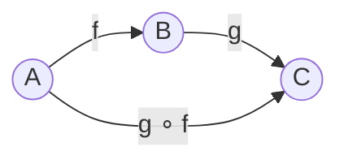

# Categories

A category is a mathematical structure whose primitive operation is composition. This chapter is about what that means, why the definition takes the shape it does, and why most of the rest of this book can be read as commentary on it.

The concept is due to @eilenbergmaclane1945general, and has since become the standard vocabulary for any situation where *things* and *directed operations between things* are studied together. It appears in topology, in algebra, in logic, in programming language theory, and in the theory of databases. Our concern here is the appearance of it in panproto's world: the things are schemas and the directed operations are migrations between them. By the end of this chapter we will have pinned down what those words mean precisely enough to be usable in every chapter that follows.

A reader who has seen categories before can skim the first two sections and pick up at the [The category of schemas](#the-category-of-schemas). A reader who has not should plan on about thirty minutes. The definition is not long, but the habit of thinking in terms of it takes practice; we will give the definition, then do three worked instances of it, then come back and check that the definition actually fits.

This chapter covers:

- the primitive operation of composition, in three everyday settings
- the formal definition of a category
- how Haskell types, panproto schemas, and Unix pipelines fare against the definition
- isomorphisms, which are the arrows that recognise when two objects are the same from the category's point of view

Composition is the operation that all of Part I is about, and the category of schemas is the setting where all of Part II takes place. If there is one chapter of this book to read slowly, this is it.

## Composition, in three settings

Before writing down what a category is, we will look at three places the structure already shows up. A reader who has ever chained two functions together, piped two shell commands, or run a data migration after another data migration has already used the operation a category is built around. The goal of this section is to make that recognition explicit, so that the definition, when it arrives, lands as a name for something familiar rather than as a new imposition.

The running example of the chapter is a small story about an address record. A team maintains a dataset of people. Each person has a name and an email address. The team decides to add a phone field. Later they decide to rename `email` to `contact_email` for consistency with a sibling field `contact_phone`. Each decision is a migration. Running both migrations in order takes the original dataset to its final form, and the *combined* operation behaves like a single migration that does both things at once. We will keep this running through the chapter.

### Function composition

The first place a programmer has already met composition is in the wiring together of functions. Suppose we have a function that trims whitespace from a string and a second function that parses a trimmed string into a date:

```haskell
trim  :: String -> String
parse :: String -> Date
```

*Listing 1.1: Two function signatures, in Haskell notation. The double colon reads "has the type". An arrow between two types is the type of a function from the type on the left to the type on the right. `trim` reads as "a function from strings to strings"; `parse` reads as "a function from strings to dates".*

Given a raw string, we can first trim it and then parse the result. The operation that does both in one go is itself a function from strings to dates. Haskell lets us name the combined operation directly:

```haskell
parse . trim :: String -> Date
```

*Listing 1.2: Function composition in Haskell. The period is the composition operator; it is pronounced "after". `parse . trim` is parse after trim: applied to a string `s`, it computes `parse (trim s)`.*

The same combined operation exists in every language that has functions, whether or not there is a piece of syntax for it. In Rust it would be written by hand:

```rust
fn trim(s: String) -> String { /* ... */ }
fn parse(s: String) -> Date  { /* ... */ }

fn parse_trimmed(s: String) -> Date {
    parse(trim(s))
}
```

*Listing 1.3: The same composition in Rust. Rust has no built-in period operator, so the composite is a new named function whose body runs the two originals in sequence.*

Whether we write `parse . trim`, `parse(trim(s))`, or `parse_trimmed`, we are pointing at the same mathematical object: a function whose input is a string and whose output is a date. The operator `.` is a piece of convenience; the object it produces is the main point.

One subtlety worth naming in advance: the order of composition is right-to-left. The rightmost function is the one that runs first. This matches ordinary function application, `parse(trim(s))`, where the innermost function is evaluated first. It clashes with the convention used by Unix pipes and F#'s `>>` operator, which run left-to-right. We will stay with the right-to-left convention throughout, and we will flag it on each of its first few uses so that a reader calibrated to pipe syntax has a chance to re-calibrate.

### Command composition in a shell

The second place composition already lives is in the [Unix](https://en.wikipedia.org/wiki/Unix) shell. A pipeline is a chain of commands, each consuming the output of the previous one.

```
lsof | grep Chrome | wc -l
```

*Listing 1.4: A Unix pipeline built from three commands: `lsof` lists open files, `grep Chrome` keeps the ones that mention Chrome, and `wc -l` counts them.*

Each command is a process. The vertical bar connects the output of one command to the input of the next. The end result is itself a process that consumes whatever the first command consumes and produces whatever the last command produces. Composing three commands produces a new "command"; composing two "commands" produces a new "command". The operation the vertical bar names is doing the same structural job as the period in Haskell: it takes two operations whose ends fit and returns one new operation.

The pipeline example is the one that will not survive the chapter intact. We will come back to it in [The three examples, checked](#the-three-examples-checked) and admit that processes do not actually form a category in the strict sense — side effects and buffering get in the way. The example is useful as motivation and illegitimate as a formal instance, which is a situation we will encounter more than once in the book.

### Migration composition

The third setting is the one this book is about. Panproto represents a schema — an ATProto lexicon, an Avro record, a SQL table, a Rust source grammar, a FHIR resource — as an object in a specific category. A migration from one schema to another is a morphism between two objects of that category. Running two migrations in sequence yields a new migration, whose combined effect on the data is the same as running the two in sequence but which the engine can manipulate as one thing.

Back to the running example. Let $S_0$ be the original schema with `name` and `email` fields. Let $S_1$ be the schema with `name`, `email`, and `phone` fields. Let $S_2$ be the schema with `name`, `contact_email`, and `phone` fields. The team's first migration $m_{01} : S_0 \to S_1$ adds the phone field. The second migration $m_{12} : S_1 \to S_2$ renames the email field.

The composed migration

$$m_{12} \circ m_{01} \;:\; S_0 \to S_2$$

takes a record from $S_0$ to $S_2$ in one step. It is a migration in exactly the same sense that $m_{01}$ and $m_{12}$ are migrations, and the migration engine in [`panproto-mig`](https://docs.rs/panproto-mig/latest/panproto_mig/) treats it that way: it is a first-class value of the same Rust type, built by [`panproto_mig::compose`](https://docs.rs/panproto-mig/latest/panproto_mig/compose/).

### The pattern

In all three settings we have a *class of things* and a *class of arrows between things*, together with an operation that composes two arrows whose ends fit. Function types are connected by functions. Shell streams are connected by processes. Panproto schemas are connected by migrations. The mathematical structure that captures exactly this pattern is a category.

At this point a reasonable reader asks: why bother naming a structure this basic? If every programmer already knows what function composition is, what does calling it a "category" buy us?

The answer, developed over the next several chapters, is that once the structure is named, we can talk about things that are true of *every* instance of it at once. The identity law we will see below is something any working programmer would verify for their favourite kind of arrow without thinking. The usefulness of the definition is that verifying it for migrations, for functions, for lenses, and for the instance-of relation buys us access to a shared toolbox: functors, natural transformations, colimits, adjunctions. Every one of those tools applies the moment we have named the underlying structure. The rest of Part I is that toolbox.

## The definition of a category

Having seen the pattern, we give it a name. The definition is short. We will state it, then unpack it piece by piece.

A **category** $\mathcal{C}$ is a collection of four pieces of data and two axioms relating them.

1. A class $\mathrm{Ob}(\mathcal{C})$ of **objects**.
2. For each ordered pair of objects $A$ and $B$, a set $\mathcal{C}(A, B)$ of **morphisms** from $A$ to $B$. A morphism $f \in \mathcal{C}(A, B)$ is written $f : A \to B$.
3. For each triple of objects $A$, $B$, $C$, a **composition** operation
   $$\circ \;:\; \mathcal{C}(B, C) \times \mathcal{C}(A, B) \to \mathcal{C}(A, C)$$
   that sends a pair $(g, f)$ of morphisms with $f : A \to B$ and $g : B \to C$ to a morphism $g \circ f : A \to C$.
4. For each object $A$, a distinguished **identity morphism** $\mathrm{id}_A : A \to A$.

These are required to satisfy two axioms.

**Associativity.** For every triple $f : A \to B$, $g : B \to C$, $h : C \to D$,
$$h \circ (g \circ f) \;=\; (h \circ g) \circ f.$$

**Identity.** For every morphism $f : A \to B$,
$$f \circ \mathrm{id}_A \;=\; f \;=\; \mathrm{id}_B \circ f.$$

That is the whole definition. It is worth reading twice; it will appear in every chapter that follows, and every construction in Part I is either an instance of it, a map between instances of it, or a property derived from it.

### Reading the definition

The four pieces of data split cleanly into "things" and "arrows between things". Objects are the things. Morphisms are the arrows. Composition says what happens when two arrows line up end-to-end. Identities pick out, for each thing, the trivial arrow that goes from it to itself.

The definition does not say what an object *is*. An object is whatever the category has decided to call one. In the category of Haskell types, an object is a Haskell type. In the category of panproto schemas, an object is a schema. In the category of topological spaces, an object is a topological space. The category's objects are defined by being objects of the category; the definition makes no further demand.

The same goes for morphisms. In the category of Haskell types, morphisms are Haskell functions. In the category of panproto schemas, morphisms are migrations. In the category of topological spaces, morphisms are continuous maps. The only thing the definition fixes is that between any two named objects there is a *set* of morphisms (not a proper class); categories for which this holds are called **locally small**. Every category in this book is locally small, and we will not say so again.

One more piece of vocabulary before we get to the axioms. The set $\mathcal{C}(A, B)$ is called a **hom-set**, short for "set of homomorphisms", which is a historical name inherited from the first categories that were studied: ones whose objects were algebraic structures and whose morphisms preserved the structure. Some authors write $\mathrm{Hom}_\mathcal{C}(A, B)$ or $\mathrm{Hom}(A, B)$ when the ambient category is clear. We use $\mathcal{C}(A, B)$ throughout, since it is less to write and no less precise. The words **arrow** and **morphism** are synonymous. We tend to say "arrow" when we are drawing diagrams and "morphism" when we are writing equations.

### Associativity, explained slowly

Associativity says that a chain of three or more composable morphisms has a well-defined composite, independent of how we fold adjacent pairs together.

Given

$$A \xrightarrow{f} B \xrightarrow{g} C \xrightarrow{h} D,$$

there are two ways to reduce the chain to a single morphism from $A$ to $D$. We can compose the first two, yielding $g \circ f : A \to C$, and then compose that with $h$, yielding $h \circ (g \circ f)$. Or we can compose the last two, yielding $h \circ g : B \to D$, and then compose the result with $f$, yielding $(h \circ g) \circ f$. The axiom says these two morphisms are equal. The common value may therefore be written $h \circ g \circ f$ without parentheses, and no one has to ask which way it was associated.

The reader who has chained three functions together has already relied on this axiom, perhaps without noticing. `parse . trim . normalize` is unambiguous because function composition is associative. If it were not, Haskell's `.` would have to commit to an associativity convention (left or right) and the programmer would have to remember it.

Every category we work with in this book has composition that is associative for a reason specific to the category. For Haskell, two functions agreeing on every input are equal, and both associations yield the same value at every input. For panproto schemas, two migrations producing the same lifted records on every input instance are equal, and the same argument applies. The point of the definition is that once the axiom is known to hold, the reasoning ceases to be specific to the category; we may simply say "$\circ$ is associative" and use that fact everywhere.

### The identity law, explained slowly

The identity law says that composing any morphism with an identity on either side leaves it unchanged. In equations:
$$f \circ \mathrm{id}_A \;=\; f \qquad \text{and} \qquad \mathrm{id}_B \circ f \;=\; f.$$

We can picture the law as a commutative square, for every $f : A \to B$:

$$
\begin{CD}
A @>{\mathrm{id}_A}>> A \\
@V{f}VV @VV{f}V \\
B @>>{\mathrm{id}_B}> B
\end{CD}
$$

*Figure 1.1: The identity law. Traversing the top and then the right yields $f \circ \mathrm{id}_A$; traversing the left and then the bottom yields $\mathrm{id}_B \circ f$; the axiom requires both to equal $f$.*

The identity plays the role a zero plays in addition, or a one in multiplication: it is the element that leaves whatever it is combined with unchanged. The identity on a type is the function that returns its argument. The identity on a schema is the migration that leaves every record unchanged. The identity on a topological space is the map that sends every point to itself.

A fair question is why the law needs to be stated at all. In every example we have looked at, the identity morphism is so obviously neutral that the law seems automatic. The reason is that the definition of a category does not pick out the identity morphism for us; it merely requires that some designated morphism play the role. When we construct a new category, it is on us to exhibit identities and show they satisfy the law. The law is a quality check on the construction.

### A small worked example

We can draw a category in full, with a finite number of objects and morphisms, as a directed graph whose vertices are the objects and whose edges are the morphisms.



*Figure 1.2: A category with three objects and three non-identity morphisms. The right column reads $B \xrightarrow{g} C$; the left column reads $A \xrightarrow{g \circ f} C$; the top row reads $A \xrightarrow{f} B$. The bottom equality is an identity on $C$, drawn to complete the square. Identities on $A$ and $B$ are suppressed by convention.*

The convention of drawing identities only when they bear on the argument is universal; otherwise every diagram in category theory would be overrun by identity edges. We will adhere to it throughout.

### Isomorphisms

A morphism $f : A \to B$ is an **isomorphism** when there exists a morphism $g : B \to A$ satisfying both
$$g \circ f \;=\; \mathrm{id}_A \qquad \text{and} \qquad f \circ g \;=\; \mathrm{id}_B.$$

The morphism $g$, when it exists, is uniquely determined by $f$. We call it the **inverse** of $f$ and write it $f^{-1}$. Two objects $A$ and $B$ are **isomorphic**, written $A \cong B$, when there exists at least one isomorphism between them.

Isomorphism is the category's internal notion of sameness. From the point of view of the category, two isomorphic objects are indistinguishable; every construction that can be expressed in terms of the category's morphisms treats them identically. In the category of Haskell types, two types are isomorphic if there is a pair of inverse functions between them, which in practice is equivalent to their having the same inhabitants up to relabelling. In the category of panproto schemas, two schemas are isomorphic if there is a migration in each direction whose composites are the identities — that is, if the schemas are different names for the same structural content.

Recognising which morphisms of a category are isomorphisms is often the single most informative thing we can say about what the category is. We will come back to this idea in every chapter of Part I, and it will be the starting point of [Bidirectional lenses](../core/lenses.md), which are a relaxation of the isomorphism concept to a form that can survive the fact that real schema migrations are rarely invertible.

## The three examples, checked

We have a definition; we have three informal examples. The definition's value depends on whether the examples really do satisfy it. This section checks each.

### Haskell types and functions

The category $\mathbf{Hask}$ has Haskell types as its objects and Haskell functions as its morphisms. Composition is the period operator from Haskell's standard library.

```haskell
(.) :: (b -> c) -> (a -> b) -> (a -> c)
(f . g) x = f (g x)
```

*Listing 1.5: Function composition as defined in Haskell's `Prelude`. The operator `(.)` takes two functions whose ends fit and returns a new function whose body applies the second to its argument and passes the result to the first.*

The identity on any type `a` is the polymorphic function `id`:

```haskell
id :: a -> a
id x = x
```

*Listing 1.6: Haskell's polymorphic identity function. The signature says `id` takes a value of any type `a` and returns a value of the same type; the body leaves the argument untouched.*

Associativity holds because two Haskell functions that agree on every input are equal, and for every input `x`,
$$((h \circ g) \circ f)(x) \;=\; h(g(f(x))) \;=\; (h \circ (g \circ f))(x).$$
The identity law holds similarly: $(f \circ \mathrm{id})(x) = f(\mathrm{id}(x)) = f(x) = \mathrm{id}(f(x)) = (\mathrm{id} \circ f)(x)$. Both axioms reduce to the obvious fact that function application is associative and that the identity function returns its argument.

A parenthetical for readers who know some Haskell: $\mathbf{Hask}$ as described above is an idealisation. Real Haskell admits non-termination, exceptions, and the polymorphic bottom value `undefined`, and taking these into account gives a more delicate structure sometimes written $\mathbf{Hask}_\bot$. The chapters that rely on $\mathbf{Hask}$ use the idealised form, and the difference does not bear on any argument we will make. A reader who wants the delicate form can consult @barrwells1990category or @riehl2017category.

### Panproto schemas and migrations

The category $\mathbf{Sch}_P$ has the schemas under a fixed panproto protocol $P$ as its objects and migrations between them as its morphisms. The Rust representation of an object is a value of the [`Schema`](https://docs.rs/panproto-schema/latest/panproto_schema/schema/struct.Schema.html) type from [`panproto-schema`](https://docs.rs/panproto-schema/latest/panproto_schema/); the Rust representation of a morphism is a value of the [`Migration`](https://docs.rs/panproto-mig/latest/panproto_mig/migration/struct.Migration.html) type from [`panproto-mig`](https://docs.rs/panproto-mig/latest/panproto_mig/). Composition is implemented in [`panproto_mig::compose`](https://docs.rs/panproto-mig/latest/panproto_mig/compose/), and the identity migration on a schema is the migration whose lift function returns its input unchanged.

That $\mathbf{Sch}_P$ is a category is a fact about the [`panproto-mig`](https://docs.rs/panproto-mig/latest/panproto_mig/) implementation. Its associativity is checked in the crate's test suite: composing three migrations and computing the composite in either association yields identical lifted records on every input. The identity law is checked by composing an arbitrary migration with an identity and verifying that the result acts the same on every input.

Back to the running example. The team's $S_0 \xrightarrow{m_{01}} S_1 \xrightarrow{m_{12}} S_2$ composition is a morphism in $\mathbf{Sch}_P$ whose lift function, applied to an $S_0$ record, produces the corresponding $S_2$ record. It can be constructed in two lines:

```rust
let m_01 = /* the add-phone migration */;
let m_12 = /* the rename-email migration */;
let m_02 = panproto_mig::compose(&m_12, &m_01)?;
```

*Listing 1.7: Composing two migrations in `panproto-mig`. The arguments are passed in right-to-left order, matching the mathematical convention.*

What the function returns is a single `Migration` value that applies both operations to any record. Applying it to the original dataset yields the dataset renamed and extended in one step. Every chapter of Part II is about one or another facet of $\mathbf{Sch}_P$.

### Unix pipelines, and why the example does not survive

The Unix pipeline of [Command composition](#command-composition-in-a-shell) is not a category in the strict sense. The obstacles are real and each one is worth naming.

A process has side effects. The pipeline `make clean | grep foo` does not merely transform bytes; it can delete files. Two pipelines that produce identical byte sequences are not therefore "the same morphism": they can differ in what they write to disk, what signals they send, what they log. Categories require morphism equality to be an equivalence that composition respects, and there is no equivalence on Unix processes that handles side effects gracefully.

A process has buffering behaviour. `cat file | head -n 1` may, depending on buffer sizes, kill `cat` with SIGPIPE before it has read the file in full. Reordering commutative-looking operations can change what runs and what does not. The composition operation is thus not cleanly defined at the level of bytes in, bytes out.

The identity role of `cat` holds only up to an equivalence on streams that ignores timing and buffer boundaries. `cat`, in the idealised sense that motivates the example, is the identity; `cat`, the actual executable, introduces a process that reads, buffers, and writes, none of which a mathematical identity does.

The pipeline example is therefore motivation rather than an instance of the definition. It shows that composition-as-primitive already exists in the working vocabulary of anyone who has used a shell, which is what we wanted. We will not mention it again. This kind of "useful informal, illegitimate formal" situation happens often in category theory; the discipline is to know which side of the line an example falls on before reasoning with it.

## The category of schemas

We close the chapter by sharpening the category that will carry every subsequent chapter of this book: the category $\mathbf{Sch}_P$ of schemas under a fixed protocol $P$.

By a **schema**, we will mean a model of a generalised algebraic theory in the sense of [Algebraic and generalised algebraic theories](./gats.md). The class of things this covers is wider than the word "schema" might suggest. A JSON Schema document is a schema. An ATProto lexicon is a schema. An Apache Avro record definition is a schema. A SQL DDL file is a schema. A Rust source file, parsed through a tree-sitter grammar, is a schema. A FHIR resource profile is a schema. Panproto's claim, developed formally in [GATs](./gats.md) and vindicated case by case in Part IV, is that all of these are instances of the same mathematical object, and that migrations between them can therefore be treated uniformly by a single engine rather than per-format by many.

By a **migration** from a schema $S$ to a schema $T$, we will mean a structure-preserving map between the two models in the appropriate sense. What "structure-preserving" means depends on the protocol $P$, and we will make it precise in [Theory morphisms and instance migration](../core/morphisms-and-migration.md). For the purposes of the present chapter, it is enough to say that a migration is the category-theoretic shape of operation the category $\mathbf{Sch}_P$'s definition requires.

Everything in Part II develops inside this one category. Protocol composition is a colimit in a related category, covered in [Colimits and pushouts](./colimits.md). Functorial data migration, covered in [Morphisms and migration](../core/morphisms-and-migration.md), is three functors between $\mathbf{Sch}_P$ and $\mathbf{Sch}_Q$ induced by a morphism of protocols $P \to Q$. Bidirectional lenses, covered in [Lenses](../core/lenses.md), are enriched morphisms in $\mathbf{Sch}_P$. Schematic version control, covered in [Merge as pushout](../vcs/merge-as-pushout.md), uses pushouts in $\mathbf{Sch}_P$ to merge branches. Every one of these constructions relies on $\mathbf{Sch}_P$ being a category; if it were not, none of them would make sense.

## Further reading

The categorical literature is large and uneven in register. A short reading list, ordered roughly from most accessible to most demanding, is worth having if this chapter leaves the reader wanting more.

@lawvereschanuel2009conceptual, *Conceptual Mathematics*, is the gentlest book-length introduction, written for a reader who has not studied university mathematics. @awodey2010category, *Category Theory*, is a standard graduate text of the same scope as this book's foundations chapters, carefully paced and example-rich. @leinster2014basic, *Basic Category Theory*, is shorter, more opinionated, and freely available online; it is our recommendation to anyone who finds the register of this chapter too slow. @riehl2017category, *Category Theory in Context*, is comprehensive and the best reference for anyone continuing past the basics. @maclane1998categories, *Categories for the Working Mathematician*, is the original reference text and remains authoritative, though demanding.

For category theory specifically oriented to programmers, @barrwells1990category, *Category Theory for Computing Science*, and @rydeheardburstall1988computational, *Computational Category Theory*, are the two classical sources; the latter gives the same material as executable ML code. The blog series @milewski2014essence is the closest contemporary work to this book's pedagogical register and is recommended for anyone who wants an alternative pass through the same material.

## Closing

The next chapter introduces **functors**, the structure-preserving maps between categories. Every construction panproto uses to relate one protocol's schemas to another's is a functor; the chapter works out the definition, its laws, and the functors that carry panproto's migration engine.

<!--
STATUS: Categories chapter, second pass: rewritten to match Rust-Book /
Milewski pacing and hand-holding. Adds anticipated objections, named
retirements of the Unix analogy, running address-record example across
all sections, Challenges section, Further reading section.

CITATIONS still to revisit when access improves:
  - Eilenberg & Mac Lane 1945 (already cited; publisher BibTeX in file).
  - Mac Lane 1998 (already cited).
  - Awodey 2010, Leinster 2014, Riehl 2017 (all already cited).
  - Lawvere & Schanuel 2009 (already cited).
  - Milewski's blog series: cited via milewski2014essence.
-->
